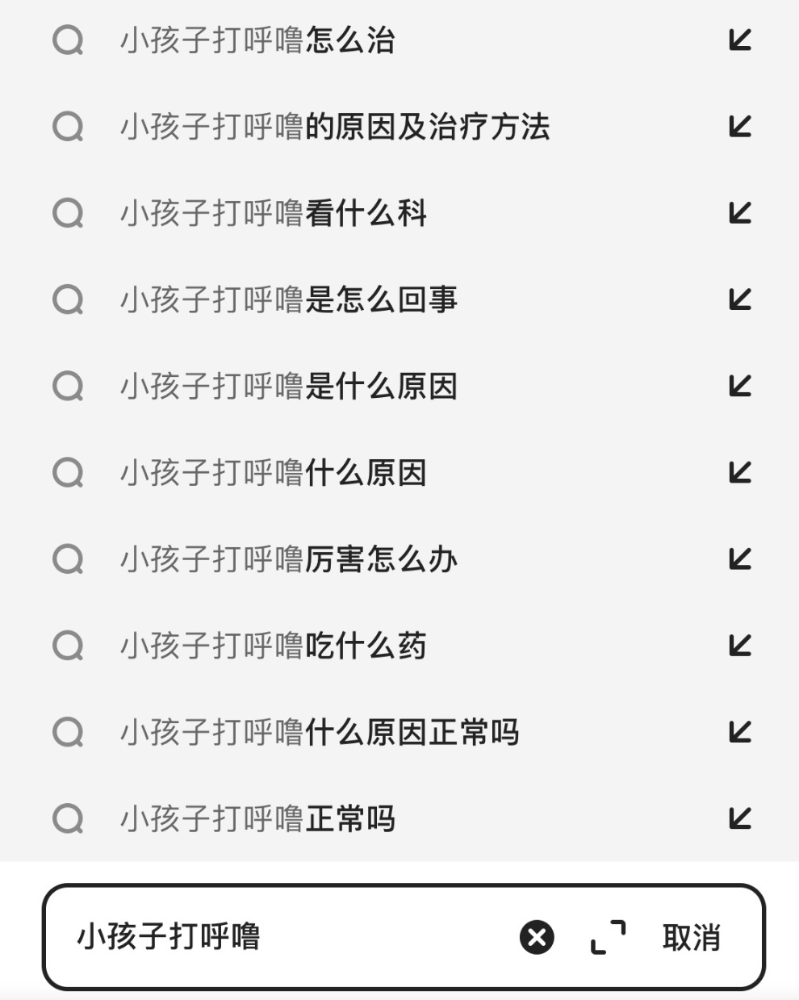

# 医学搜索Query相关性判断

## 赛题描述
Query（即搜索词）之间的相关性是评估两个Query所表述主题的匹配程度，即判断Query-A和Query-B是否发生转义，以及转义的程度。Query的主题是指query的专注点，判定两个查询词之间的相关性是一项重要的任务，常用于长尾query的搜索质量优化场景，本任务数据集就是在这样的背景下产生的。
<div align=center>


</div>

## 数据集说明

[相关数据集下载](https://tianchi.aliyun.com/competition/entrance/532001/information)

Query和Title的相关度共分为3档（0-2），0分为相关性最差，2分表示相关性最好。

2分：表示A与B等价，表述完全一致

1分： B为A的语义子集，B指代范围小于A

0分：B为A的语义父集，B指代范围大于A； 或者A与B语义毫无关联

## 环境依赖

```shell
pip install gensim
pip install numpy
pip install tqdm
conda install torch
```

## 准备
从腾讯AI Lab下载语料库
```shell
wget https://ai.tencent.com/ailab/nlp/zh/data/tencent-ailab-embedding-zh-d100-v0.2.0-s.tar.gz # v0.2.0 100维-Small
```
解压语料库
```shell
tar -zxvf tencent-ailab-embedding-zh-d100-v0.2.0-s.tar.gz
```

## 训练
```python
python train.py --datadir {datadir} --epochs 30 --lr 1e-4 --max_length 32 --batch_size 8 --savepath ./results --gpu 0 --w2v_path {w2v_path}
```

## 推理
```python
python inference.py --batch_size 8 --max_length 32 --savepath ./results --datadir {datadir} --model_path {model_path} --gpu 0 --w2v_path {w2v_path}
```


